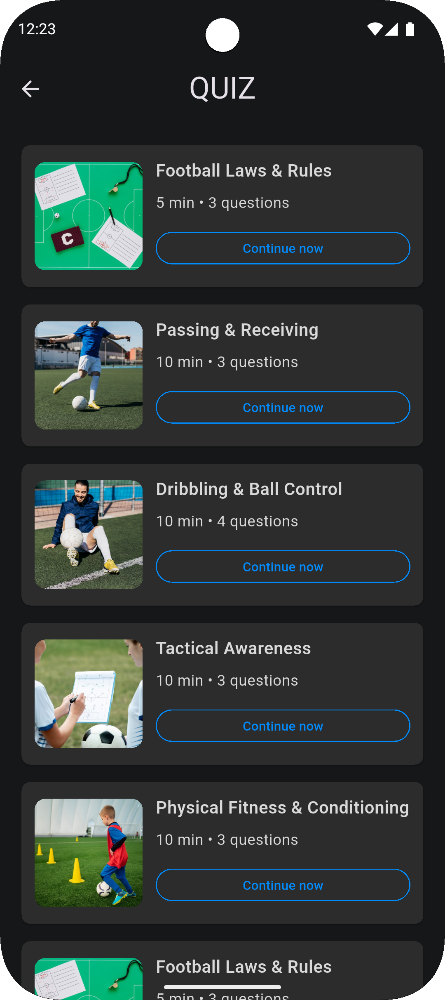
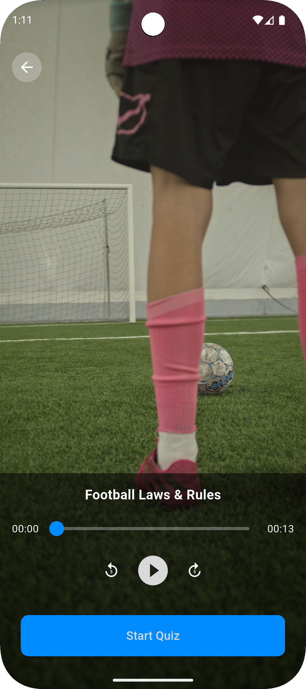
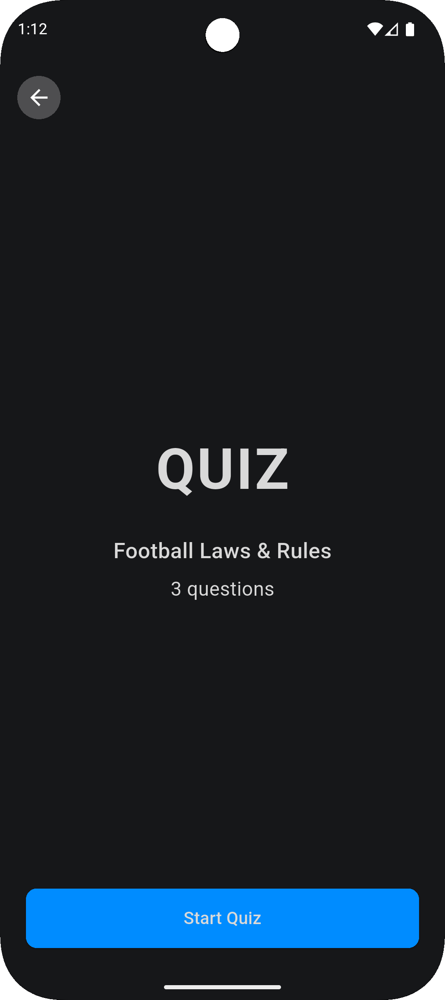
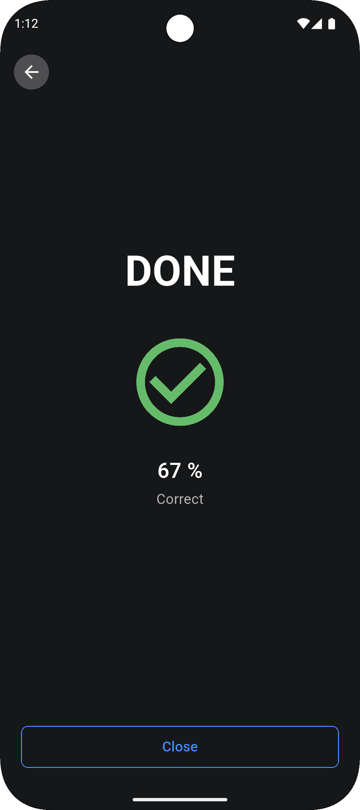
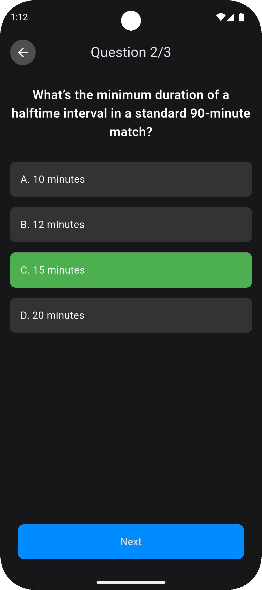
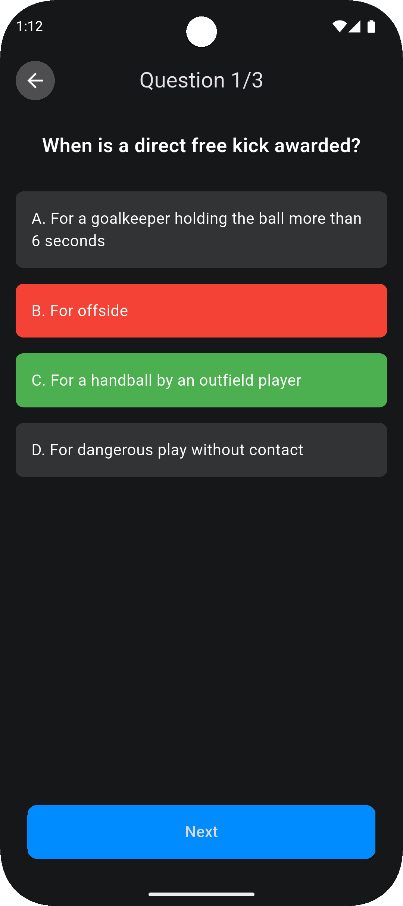

# 🎥 Quiz Video Player App

A Flutter application that plays instructional videos and quizzes users on what they learned.  
Users can browse video lessons, watch them with custom playback controls, and take interactive  
multiple-choice quizzes with instant feedback.

## 🚀 Features

- **Quiz List**
  - Loads a JSON file (`assets/quizzes.json`) containing quiz metadata
  - Displays each quiz with title, image, video length, and number of questions
  - “Continue” button opens the video player

- **Custom Video Player**
  - Uses `video_player` package to play local asset `.mp4` files
  - Includes Play/Pause, rewind, fast-forward, and scrub progress slider
  - Uses a transparent AppBar with consistent back button placement

- **Interactive Quiz**
  - Multiple-choice interface built from JSON questions
  - Shows immediate visual feedback: ✅ green for correct, ❌ red for incorrect
  - Tracks progress and correctness

- **Result Screen**
  - Summary page after finishing the quiz
  - Shows a percentage score with a “DONE” check icon
  - Option to close and return to the list

---

## 📸 Screenshots

<table>
  <tr>
    <td align="center">
       
      Quiz List
    </td>
    <td align="center">
       
      Video Player
    </td>
  </tr>
  <tr>
    <td align="center">
       
      Start Quiz
    </td>
    <td align="center">
       
      Results
    </td>
  </tr>
  <tr>
    <td align="center">
       
      Quiz Correct
    </td>
    <td align="center">
       
      Quiz Incorrect
    </td>
  </tr>
</table>

